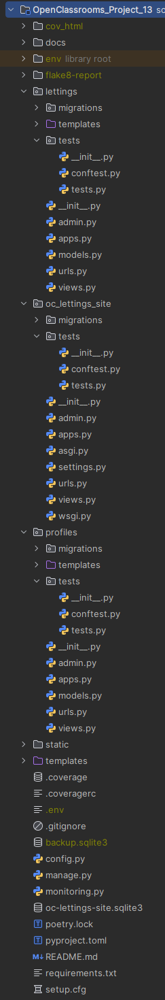
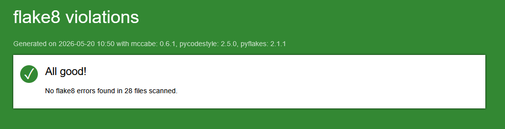
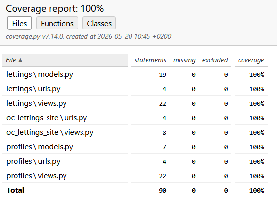
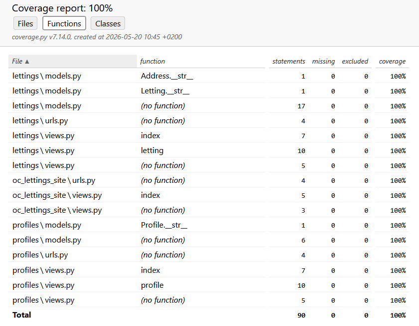

# Django App - OpenClassrooms Project 13
**Scale a Django application using a modular architecture**

---

## DESCRIPTION

This project was completed as part of the "Python Developer" path at OpenClassrooms.

The goal was to scale a Django application using a modular architecture :

- Redesign of the modular architecture in the GitHub repository;
- Reduction of various technical debts on the project;
- Addition and deployment of a CI/CD pipeline;
- Application monitoring and error tracking via Sentry;
- Creation of the application's technical documentation using Read The Docs and Sphinx.

The application must:

- allow the users to view available rentals and all the registered profiles.

---

## PROJECT STRUCTURE
<p align="center">
    
</p>

---

## INSTALLATION

- ### Clone the repository :

```
git clone https://github.com/Tit-Co/OpenClassrooms_Project_13.git
```

- ### Navigate into the project directory :
    `cd OpenClassrooms_Project_13`

- ### Create a virtual environment and dependencies :

1. #### With [uv](https://docs.astral.sh/uv/)

    `uv` is an environment and dependencies manager.
    
    - #### Install environment and dependencies
    
    `uv sync`

2. #### With pip

   - #### Install the virtual env :

    `python -m venv env`

   - #### Activate the virtual env :
    `source env/bin/activate` in Git Bash on Windows or on macOS / Linux
    Or  
    `env\Scripts\activate` on Windows  

3. #### With [Poetry](https://python-poetry.org/docs/)

    `Poetry` is a tool for dependency management and packaging in Python.
    
    - #### Install the virtual env :
    `py -3.10 -m venv env`
    
    - #### Activate the virtual env :
    `poetry env activate`

- ### Install dependencies 
  1. #### With [uv](https://docs.astral.sh/uv/)
      `uv sync` or `uv pip install -r requirements.txt` or `uv add -r requirements.txt`

  2. #### With pip
      `pip install -r requirements.txt` 

  3. #### With [Poetry](https://python-poetry.org/docs/)
      `poetry install`
  
     (NB : Poetry and uv will read the `pyproject.toml` file to know which dependencies to install)

---

## USAGE

### Launching server
- Open a terminal
- Go to project folder - example : `cd oc_lettings_site`
- Activate the virtual environment as described previously
- Create environment variables (to avoid to add raw Sentry key into the code)
  - With Power Shell :
    ```
    $env:SENTRY_KEY = "my_key"
    ```
  - With Git Bash :
    ```
    export SENTRY_KEY = "my_key"
    ```
- Launch the local server by typing the command :
  - `python manage.py runserver`

### Launching the APP

- Finally, in a web browser, open the urls :
  - [http://127.0.0.1:8000/](http://127.0.0.1:8000/)
  - [http://127.0.0.1:8000/admin](http://127.0.0.1:8000/admin) 
    - for the admin panel (username: ```admin```, password: ```Abc1234!```)
    
---

## APP EXAMPLES

Here are some examples of the application execution.

- Home page
<p align="center">
    
</p>

- Lettings index
<p align="center">
    
</p>

- Letting details
<p align="center">
    
</p>

- Profiles index
<p align="center">
    
</p>

- Profile details
<p align="center">
    
</p>

---

## PEP 8 CONVENTIONS

- Flake 8 report
<p align="center">
    
</p>

**Type the line below in the terminal to generate another report with [flake8-html](https://pypi.org/project/flake8-html/) tool :**

` flake8`
- The app code has a setup.cfg file that specify Flake 8 options as below : 
    ```
    format = html
    htmldir = flake8-report
    max-line-length = 99
    exclude = **/migrations/*,env,cov_html
    ```

---

## TESTS COVERAGE WITH PYTEST

- Coverage report
<p align="center">
    
    
</p>

- **Type the line below in the terminal to generate another coverage report with pytest**

    `pytest --cov=lettings --cov=profiles --cov=oc_lettings_site --cov-report=html:cov_html`

---


---

## AUTHOR
**Name**: Nicolas MARIE  
**Track**: Python Developer – OpenClassrooms  
**Project 13 – Scale a Django application using a modular architecture – May 2026**
