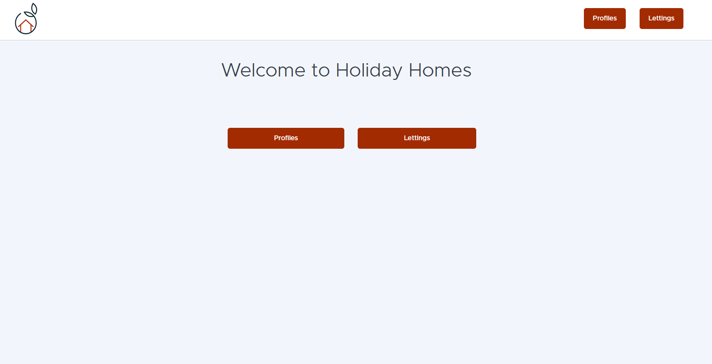
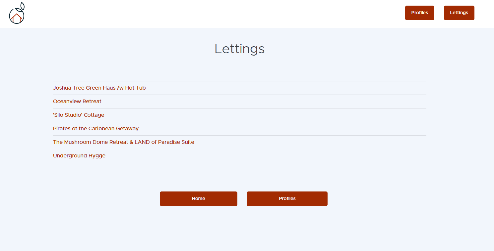
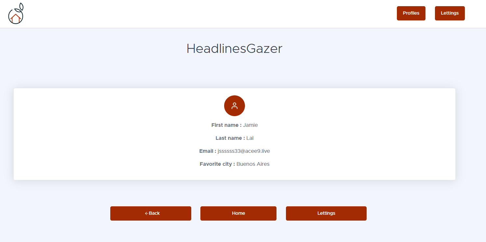
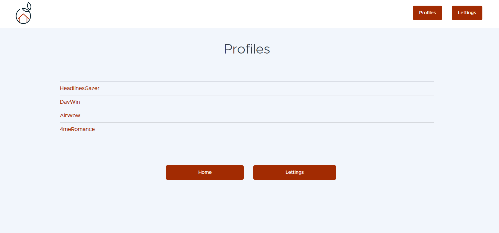

# Django App - OpenClassrooms Project 13
**Scale a Django application using a modular architecture**

---

## DESCRIPTION

This project was completed as part of the "Python Developer" path at OpenClassrooms.

The goal was to scale a Django application using a modular architecture :

- Redesign of the modular architecture in the GitHub repository;
- Reduction of various technical debts on the project;
- Addition and deployment of a CI/CD pipeline;
- Application monitoring and error tracking via Sentry;
- Creation of the application's technical documentation using Read The Docs and Sphinx.

The application must:

- allow the users to view available rentals and all the registered profiles.

---

## PROJECT STRUCTURE
<p align="center">
    
</p>

---

## INSTALLATION

- ### Clone the repository :

```
git clone https://github.com/Tit-Co/OpenClassrooms_Project_13.git
```

- ### Navigate into the project directory :
    `cd OpenClassrooms_Project_13`

- ### Create a virtual environment and dependencies :

1. #### With [uv](https://docs.astral.sh/uv/)

    `uv` is an environment and dependencies manager.
    
    - #### Install environment and dependencies
    
    `uv sync`

2. #### With pip

   - #### Install the virtual env :

    `python -m venv env`

   - #### Activate the virtual env :
    `source env/bin/activate` in Git Bash on Windows or on macOS / Linux
    Or  
    `env\Scripts\activate` on Windows  

3. #### With [Poetry](https://python-poetry.org/docs/)

    `Poetry` is a tool for dependency management and packaging in Python.
    
    - #### Install the virtual env :
    `py -3.10 -m venv env`
    
    - #### Activate the virtual env :
    `poetry env activate`

- ### Install dependencies 
  1. #### With [uv](https://docs.astral.sh/uv/)
      `uv sync` or `uv pip install -r requirements.txt` or `uv add -r requirements.txt`

  2. #### With pip
      `pip install -r requirements.txt` 

  3. #### With [Poetry](https://python-poetry.org/docs/)
      `poetry install`
  
     (NB : Poetry and uv will read the `pyproject.toml` file to know which dependencies to install)

---

## USAGE

### Launching server
- Open a terminal
- Go to project folder - example : `cd oc_lettings_site`
- Activate the virtual environment as described previously
- Create environment variables (to avoid to add raw Sentry key into the code)
  - With Power Shell :
    ```
    $env:SENTRY_KEY = "my_key"
    ```
  - With Git Bash :
    ```
    export SENTRY_KEY = "my_key"
    ```
- Launch the local server by typing the command :
  - `python manage.py runserver`

### Launching the APP
- With local server, open a web browser and type the urls :
  - [http://127.0.0.1:8000/](http://127.0.0.1:8000/)
  - [http://127.0.0.1:8000/admin](http://127.0.0.1:8000/admin) 
    - for the admin panel (username: ```admin```, password: given in the project technical specifications)
    
- With web server (after deployment), open a web browser and type the url :
    - your Heroku app url given in the Heroku dashboard, for example the url below : 
[Heroku app](https://orange-county-lettings-7b4c4811f25f.herokuapp.com/)
    
---

## APP EXAMPLES

Here are some examples of the application execution.

- Home page
<p align="center">
    
</p>

- Lettings index
<p align="center">
    
</p>

- Letting details
<p align="center">
    
</p>

- Profiles index
<p align="center">
    
</p>

- Profile details
<p align="center">
    
</p>

---

## PEP 8 CONVENTIONS

- ### Flake 8 report
<p align="center">
    
</p>

- **Type the line below in the terminal to generate another report with [flake8-html](https://pypi.org/project/flake8-html/) tool :**

    ` flake8`
    - The app code has a setup.cfg file that specify Flake 8 options as below : 
        ```
        format = html
        htmldir = flake8-report
        max-line-length = 99
        exclude = **/migrations/*,env,cov_html
        ```

---

## TESTS COVERAGE WITH PYTEST

- ### Coverage report
<p align="center">
    
    
</p>

- **Type the line below in the terminal to generate another coverage report with pytest**

    `pytest`
    - The app code has a setup.cfg file that specify Pytest options as below : 
        ```
        python_files = tests*.py
        addopts = -v --cov=lettings --cov=profiles --cov=oc_lettings_site --cov-report=html:cov_html
        ```
---

## DEPLOYMENT
- ### Docker
  - The application is containerized using Docker.
  - The Dockerfile located at the project root defines the build process:
    - install Python dependencies 
    - copy the Django project
    - collect static files
    - start the application with Gunicorn

  - The container can be executed locally for testing purposes.

- ### CI/CD Pipeline
  - The CI/CD pipeline is defined in .github/workflows/.

  - Continuous Integration

  - The CI workflow runs on every branch push and includes:
    - repository checkout
    - dependency installation
    - linting
    - test execution with pytest
    - coverage and quality report generation
    - Continuous Deployment

  - Deployment is only triggered on the master branch after successful CI validation.

  - The deployment workflow:
    - builds the Docker image
    - pushes the image to Heroku Container Registry
    - releases the application on Heroku

- ### Heroku Deployment
  - The application is deployed on Heroku using the container stack.

  - Required environment variables must be configured in the Heroku dashboard:

    - `DEBUG`
    - `DJANGO_ALLOWED_HOSTS`
    - `SECRET_KEY`

- ### Monitoring
  - Application monitoring and exception tracking are handled using Sentry.

  - To enable monitoring:
    - Create a Sentry account
    - Generate a project key
    - Add the key as a GitHub repository secret:
      - `SENTRY_KEY`

  - The secret is injected into the deployment workflow through GitHub Actions.

## DOCUMENTATION
- ### ReadTheDocs documentation :
  - A ReadTheDocs documentation for technical specifications is linked to the repository
  - The documentation includes :
    - a project description
    - project installation instructions
    - a quick start guide
    - the technologies and programming languages to be used
    - a description of the database structure and data models
    - a description of the programming interfaces
    - a user guide (with use cases)
    - application deployment and management procedures

---


[](https://tit-co-oc-lettings-documentation.readthedocs.io/en/latest/)

---

## AUTHOR
**Name**: Nicolas MARIE  
**Track**: Python Developer – OpenClassrooms  
**Project 13 – Scale a Django application using a modular architecture – May 2026**
