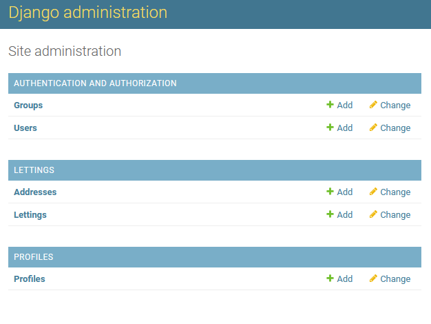

Database structure and models
=============================

The code has been split in 3 different apps vs only one in the old version :

* lettings
* oc_lettings_site
* profiles

Each new app has 5 main modules as below :

* admin.py for the representation in admin page
* apps.py for the app namespace
* models.py for the models used by the database (except for oc_lettings_app)
* urls.py for the urls
* views.py for the views

Lettings models
---------------
In the lettings models there are 2 objects with all attributes regarding the address and letting, previously implemented in the first version of the application :

* Address object

================  ====================
Attribute         Type
================  ====================
number            PositiveIntegerField
street            CharField
city              CharField
state             CharField
zip_code          PositiveIntegerField
country_iso_code  CharField
================  ====================

* Letting object

=========  ========================
Attribute  Type
=========  ========================
title      CharField
address    OneToOneField to Address
=========  ========================

Oc_lettings_site models
-----------------------
No models are currently available in this application in its new version.

This Django app serves only as an entry point of the web application and for Django settings.

Profiles models
---------------
In the profiles models, there is 1 object with all attributes regarding the profiles previously implemented in the first version of the application :

* Profile object

=============  =====================
Attribute      Type
=============  =====================
user           OneToOneField to User
favorite_city  CharField
=============  =====================

Database admin page
-------------------
Here is a screenshot from the database admin page :

