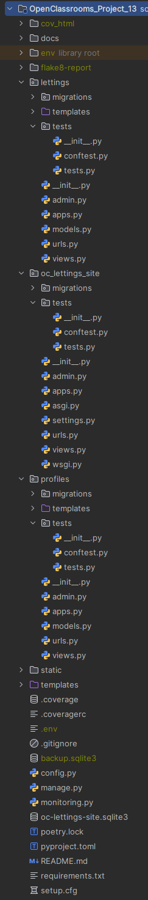

Description
===========
Orange County Lettings is a startup in the real estate rental sector. The startup is currently expanding rapidly in the
United States.
The Orange County Lettings teams developed the
`OC_Letting_Site <https://orange-county-lettings-7b4c4811f25f.herokuapp.com/>`_ web application and the new scaled
version has just been released.

Summary
-------

The new version has been scaled using a modular architecture.

What we have done :

* Redesign of the modular architecture in the Git platform repository
* Reduction of various technical debts on the project
* Addition and deployment of a CI/CD pipeline
* Application monitoring and error tracking via Sentry
* Creation of the application's technical documentation using Read The Docs and Sphinx

The application must :

* allow the users to view available rentals and all the registered profiles.

Architecture
------------

Overview
^^^^^^^^

Modular architecture
^^^^^^^^^^^^^^^^^^^^
The architecture has been optimized by reducing the technical debts from the previous monolithic design.

The code has been :

* reorganized into several separate Django applications
* reorganized into application-specific HTML templates folders

This optimization has improved the flexibility, maintainability, and scalability of the code.

Finally, each app has its own :

* views module
* urls module
* templates folder
* test folder with several test modules for models, views and urls
