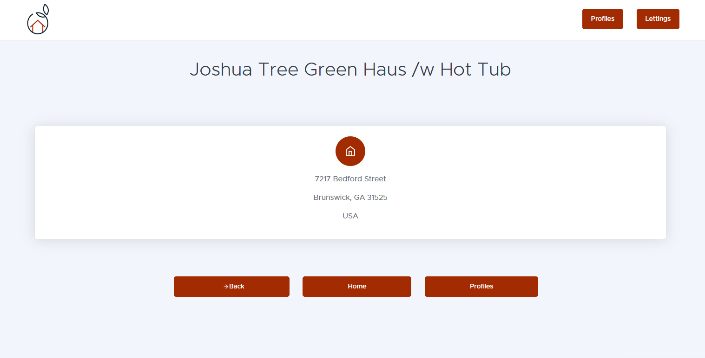
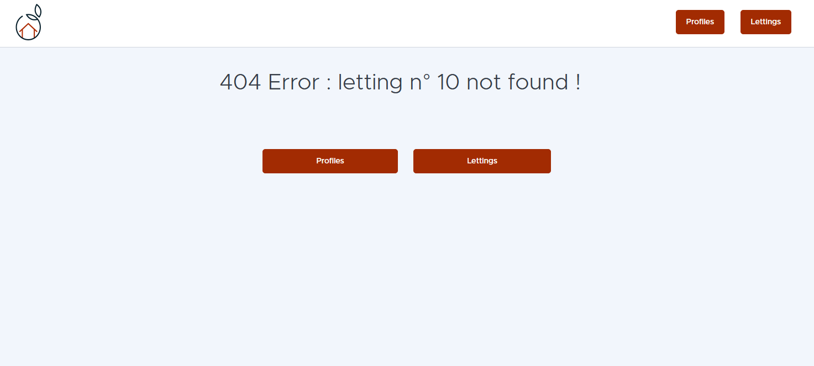

User guide with use cases
=========================

Quick overview
--------------
Orange County Lettings allows the user to browse available rentals and all the registered profiles.

The user has access to lettings and profiles lists, and can display a letting or a profile detail by id or username.

Example of main use cases
-------------------------

Home page
^^^^^^^^^
.. image:: _static/home_page_screenshot.png

Lettings list page
^^^^^^^^^^^^^^^^^^
.. image:: _static/lettings_list_screenshot.png

Letting details page
^^^^^^^^^^^^^^^^^^^^
.. image:: _static/letting_details_screenshot.png

Profiles list page
^^^^^^^^^^^^^^^^^^
.. image:: _static/profiles_list_screenshot.png

Profile details page
^^^^^^^^^^^^^^^^^^^^

Letting 404 error page
^^^^^^^^^^^^^^^^^^^^^^

Use cases
---------

Browsing lettings
^^^^^^^^^^^^^^^^^
Here is the procedure :

* Open the home page

* Click on the "Letting" link

* Select a letting from the list

* The detail page displays the address and related information

Viewing profiles
^^^^^^^^^^^^^^^^
The procedure is more or less the same :

* Open the Profiles page.

* Select a profile from the list.

* The application displays the user profile details.

Returning to home page
^^^^^^^^^^^^^^^^^^^^^^
Here is the procedure :

* In the lettings page or profiles page, click on the "Home" button

* The application displays the home page
